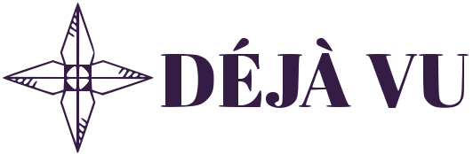

<p align="center"><a href="https://github.com/marufmax/dejavu" target="_blank"></a></p>
<p align="center">
    Laravel - DejaVu
</p>
### Laravel Redis sentinel support for High Availability :arrow_up: :arrow_up: :fire:  


### Features

* Supports Multiple Sentinel, Slaves and Master
* Reading to slaves and writing to master if there is instance available it will send request to that instance
* Connection pooling by default, so there is no multiple TCP connection 
* Master and Slave Auto Discovery  and random traffic passing


## Installation
This package requires  minimum **PHP 7.2** and **Laravel 7.x** version. And **PHPRedis** according to your PHP Version.  

#### **Install PHPRedis (Skip if you have it)**

**Installing PHP-Pear**

```shell
apt install -y php-pear
```

**Installing Redis Client**

```shell
printf "no\n" | pecl install redis
```

**Adding Extension to php module**

```
echo "extension=redis.so" > /etc/php/7.YOUR_PHP_VERSION/mods-available/redis.in
```

**Symlinking with FPM and CLI** 

```
ln -sf /etc/php/7.YOUR_PHP_VERSION/mods-available/redis.ini /etc/php/7.YOUR_PHP_VERSION/fpm/conf.d/20-redis.ini
ln -sf /etc/php/7.YOUR_PHP_VERSION/mods-available/redis.ini /etc/php/7.YOUR_PHP_VERSION/cli/conf.d/20-redis.ini
```

**Restarting PHP Service**

```
systemctl restart php7.YOUR_PHP_VERSION-fpm.service
```


#### Installing DejaVu Package

run this command from terminal: 

```shell
composer require marufmax/dejavu
```


Add those to your `.env` file: 

```
# Redis Configuration (Use comma Separated if have multiple)
REDIS_SENTINELS_IPS=172.16.0.11,172.16.0.12
REDIS_SENTINELS_PORTS=26379,26380
REDIS_SENTINELS_TIMEOUTS=1.0,1.0
```

Here there is two redis sentinels server. Please put only sentinel server not any master or slaves IPs. 


## Quick Usages
Simply use `DejaVu` Facade instead of `Cache` Facade. Below is a very simple example
```shell
\MarufMax\DejaVu\Facades\DejaVu::put('hi', 'hello', 36);

dd(\MarufMax\DejaVu\Facades\DejaVu::get('hi'));
```


Thanks :cat: 

